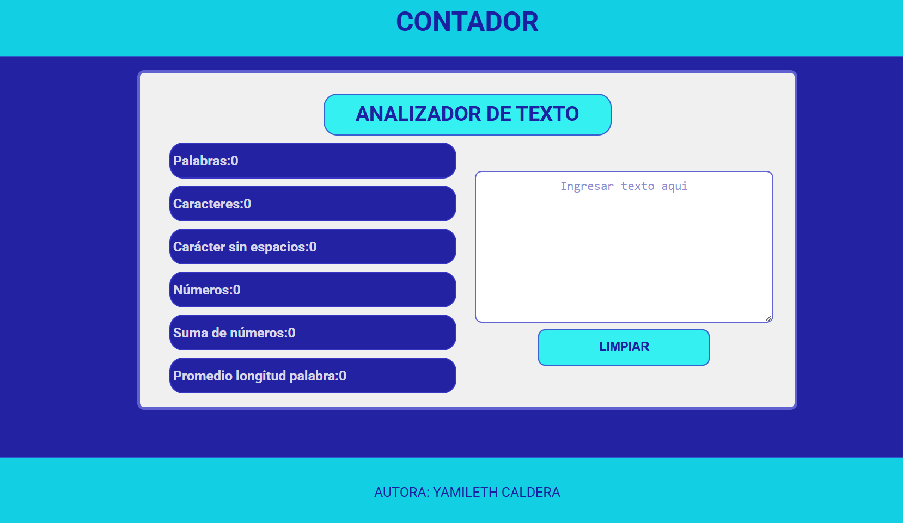

# Analizador de texto

## Índice

* [1. Consideraciones Generales](#1-consideraciones-generales)
* [2. Preámbulo](#2-preámbulo)
* [3. Funcionalidades](#3-funcionalidades)
* [4. Criterios de aceptación mínimos del proyecto](#4-Criterios-de-aceptación)
* [5. Pruebas](#5-pruebas)

### 1. Consideraciones Generales

Este proyecto educativo permite analizar métricas de un texto ingresado, incluyendo conteo de palabras, caracteres, números y su sumatoria, además de la longitud promedio de las palabras. En futuras versiones, se agregarán más funcionalidades para mejorar su utilidad.

### 2. Preámbulo

El Analizador de Texto extrae y muestra diversas métricas de un texto ingresado por el usuario, facilitando el análisis de su contenido.

### 3. Funcionalidades

Conteo de palabras: Excluye números y cuenta solo palabras.

Conteo de caracteres: Incluye signos de puntuación y espacios.

Conteo de caracteres sin espacios: Excluye espacios y signos de puntuación.

Conteo de números: Cuenta solo dígitos numéricos.

Suma de números: Suma todos los números presentes en el texto.

Longitud promedio de palabras: Calcula la media de longitud de las palabras.

## Tecnologías Utilizadas

HTML: Estructura con encabezados, listas y un textarea para ingreso de texto.

CSS: Estilos básicos con un diseño centrado en la usabilidad.

JavaScript: Implementación de la lógica para el análisis del texto.

### 4. Criterios de Aceptación

HTML

Encabezado con "ANALIZADOR DE TEXTO".

Lista desordenada ul con 6 elementos li.

Un textarea con el atributo name="user-input".

Un botón con id="reset-button".

Un pie de página con el nombre del autor.

CSS

Estilos aplicados con selectores de etiqueta, clases y atributos.

Uso de modelo de caja y diseño responsivo.

JavaScript

Objeto analyzer con 6 métodos para calcular las métricas.

Uso de split(), trim(), replace(), condicionales y bucles.

Interacción con el DOM mediante querySelector y getElementById.

Eventos input en textarea y click en el botón.

### 5. Pruebas

Configuración Inicial

Crear una cuenta en GitHub.

Configurar SSH y clonar el repositorio.

Instalar dependencias con:

npm install
npx playwright install chromium --with-deps
npm start

Acceder a http://localhost:3000.

Pruebas Unitarias

Ejecutar las pruebas con:

npm run test:oas-html
npm run test:oas-css
npm run test:oas-web-api
npm run test:oas-js

Estas verifican que HTML, CSS, JavaScript y Web APIs cumplan los criterios de aceptación.

Pruebas End-to-End

npm run test:e2e

Simula la interacción de un usuario con la aplicación.

Despliegue en GitHub Pages

El sitio web se publica en GitHub Pages para su acceso público.

Desarrollado por Yamileth Caldera
